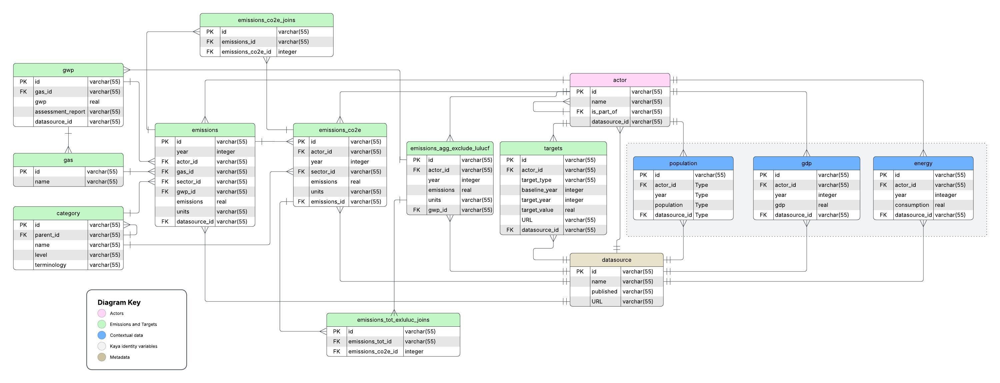

# Schema

`models.py` contains [SQLModel](https://sqlmodel.tiangolo.com/) classes for each table in the database. SQLModel classes serve two functions: they can be used to create database tables and they can be used to validate data being imported into the database. 

## Migrations

We use [alembic](https://alembic.sqlalchemy.org/en/latest/) for database migrations since [SQLModel](https://sqlmodel.tiangolo.com/)  is built on top of [SQLAlchemy](https://www.sqlalchemy.org/). 

The project is setup for automatic migrations. What this means is after you modify the schema in `models.py`, you run the following command in your terminal:

```sh
alembic revision --autogenerate -m "{message}" --rev-id $(date +"%Y%m%d%H%M%S")
```

Make sure to change the message. Because it uses the `--autogenerate` flag, this will automatically create a timestamped migration file in `/migrations/versions`. 

Now you can apply the migration using:

```sh
alembic upgrade head
```

## Entity Relationship Diagram (ERD)

The ERD below displays the design on the database thus far. This may not exactly match the state of `models.py`

